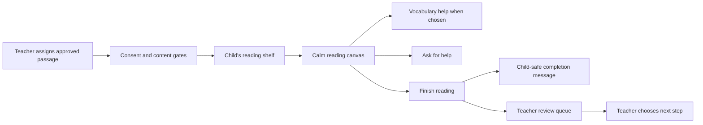
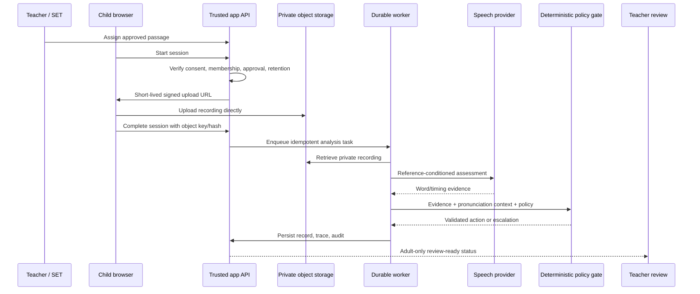

# Reader Leader: Child-Centred Implementation and Technology Plan

**Purpose:** Define the most beneficial, realistic, and safe next path for making Reader Leader useful to children aged 8–10 while preserving its core advantage: a literacy professional remains the authority and the system is rewarded for avoiding a false correction.

**Status:** Recommended implementation plan. It extends the existing synthetic reading journey, but it does **not** authorise live child-audio collection or production speech assessment.

---

## 1. The decision: build a reading journey, not a generic AI tutor

The strongest Reader Leader product is a **guided reading journey connected to an adult evidence workflow**. It should not compete head-on with generic practice products that already offer unlimited passages, broad gamification, or automated pronunciation scoring. Reader Leader’s differentiated value is that a child can read calmly while the adult receives a safe, traceable, and reviewable record; the system treats uncertain evidence, regional pronunciation, and self-correction as reasons to wait or escalate rather than reasons to correct.[1] [2]

> **Product promise:** “Reader Leader gives every child a listener without asking the AI to become the teacher.”

For children aged 8–10, the child experience should feel like a short, predictable reading activity: choose or receive a passage, read it in a calm focused space, use help if needed, and finish with encouragement. It should not feel like a test, a scoreboard, or a surveillance tool. The adult experience should connect the child activity to approved content, safe session creation, evidence review, and a planned next step.

| Product area | Recommended direction | Avoid |
|---|---|---|
| Reading | Short approved passages, clear reading goal, predictable start/finish, optional adult-assigned sequence. | An open content feed, an endless reading race, or unexplained difficulty labels. |
| Vocabulary | Teacher/content-steward authored word cards tied to approved passages. | Free-form LLM explanations sent straight to the child. |
| Motivation | Participation and agency: choose a theme, finish a reading path, save a favourite word, collect local “reading moments.” | Points for perceived correctness, public leaderboards, streak pressure, social comparison, or rewards that punish a self-correction. |
| Feedback | Approved, short, neutral, encouraging templates. | Diagnostic labels, raw confidence, corrections generated from an uncertain model, or claims the system understands the child’s speech. |
| Assessment | Adult-only evidence and policy-supported next-step suggestions. | Child-visible reading scores, level changes, pass/fail outcomes, or automatic intervention decisions. |

---

## 2. North-star child experience

### 2.1 The complete child journey

The next product milestone should be a working **Reading Journey**. It is deliberately smaller than a full learning platform, but it is coherent enough that a child, teacher, and judge understand the product immediately.



The existing application already implements a synthetic version of the consent gate, approved-passage selection, a child reading canvas, safe help/finish states, teacher hand-off, deterministic mock word events, and adult review. The following design turns that foundation into a deliberate learning experience rather than a technical demo.[3]

### 2.2 Child screens and behaviour

| Screen | Child sees | Child can do | System and adult boundary |
|---|---|---|---|
| **My reading shelf** | Up to three teacher-assigned or teacher-approved passages as illustrated cards; an adult-selected “Today’s reading” card. | Open an assigned passage, resume an unfinished local session, choose a visual reading theme. | The shelf contains only `APPROVED` passages and never exposes teacher notes, ratings, or peer activity. |
| **Ready to read** | Title, cover/visual, “about this reading” sentence, estimated *reading time* only if teacher-approved, and a calm start button. | Start, change text size/line spacing, choose Focus mode. | Never shows a reading level as a judgement of the child. Do not enable microphone access until the production gate is complete. |
| **Reading canvas** | One manageable passage part at a time, large high-contrast type, progress as “Part 2 of 5,” current reading theme, and optional vocabulary underlines. | Navigate previous/next part, Save my place, clear bookmark, turn Focus mode on/off, select a word to open a vocabulary card, ask for help. | Progress is navigation only, not speed, accuracy, time-on-task, or score. Local preference/bookmark state should be minimised. |
| **Vocabulary card** | Word, child-friendly definition, short context sentence, syllable chunks when relevant, optional teacher-approved image/illustration. | Close card, save as a local “word to revisit,” ask a teacher about the word. | Definitions are authored/reviewed adult content, not live LLM output. No pronunciation judgement is presented. |
| **Help state** | An approved prompt such as “Take your time. You can look at the word parts or ask your teacher.” | Return to text, open word card, flag “I would like help.” | “I would like help” is a child choice, not evidence that the child failed. Adult sees it as contextual information only. |
| **Completion** | A fixed neutral completion message and participation celebration, such as “You completed today’s reading journey.” | Return to shelf or wait for teacher. | No stars/points for correctness, no score, no claim that voice has been assessed. The teacher receives the review-ready item. |

### 2.3 Design system for ages 8–10

The implementation should use a visually warm, calm, and legible reading space. Existing adult dashboard styling should **not** be reused for the child surface.

| Design principle | Implementation choice |
|---|---|
| Predictability | Keep the same placement for Start, Help, Bookmark, Next, and Finish across passages. Use plain language and short sentences. |
| Legibility | Offer three text-size levels, three line-spacing levels, a high-contrast palette, no justified text, comfortable line length, and keyboard controls. |
| Cognitive load | Show one sentence/short paragraph at a time in Focus mode; keep secondary controls in a labelled “Reading tools” drawer. |
| Child agency | Allow theme choice, text settings, local bookmark, word cards, and “I need help.” Do not let a child edit content, session data, or policy outcomes. |
| Emotional safety | Use neutral wording: “Let’s keep going,” “Take your time,” and “Your teacher will look at the next step with you.” Never say “wrong,” “failed,” “below,” or “accuracy.” |
| Motion | Use light transitions for opening a card or moving to the next passage part. Respect `prefers-reduced-motion`; never animate a correction or score. |
| Accessibility | Keyboard navigation, visible focus, semantic buttons, `aria-live` only for essential state changes, low-colour-dependence status, responsive tablet layout, and no forced audio. |

---

## 3. Vocabulary support that adds learning value

Vocabulary is the highest-value child-learning expansion before live audio. It can be useful without making accuracy claims and is controllable by adults.

### 3.1 Recommended vocabulary model

Each approved passage should have a small, adult-curated set of **three to six vocabulary cards**. Each card should focus on one useful word or phrase that supports meaning or decoding. Cards must be optional, available before/during/after reading, and written at an age-appropriate level.

| Vocabulary field | Purpose | Example |
|---|---|---|
| `term` | Exact word or phrase in the passage. | `harbour` |
| `display_label` | Child-friendly form. | `har-bour` |
| `child_definition` | Brief, concrete explanation. | “A safe place where boats wait near land.” |
| `context_sentence` | Meaning in the current passage. | “The boats waited quietly in the harbour.” |
| `word_parts` | Optional syllable/morpheme display. | `har · bour` |
| `illustration_key` | Optional reviewed visual asset. | Private/approved illustration reference. |
| `teacher_prompt` | Adult-only follow-up question. | “Can you point to what makes a harbour safe?” |
| `review_status` | Child visibility gate. | `APPROVED` |

The first implementation should be **manual and teacher/content-steward authored**. A future structured-content assistant may propose vocabulary candidates, definitions, and syllable splits, but a human must review each child-visible element before publication. The assistant must treat passage text as data—not instructions—and must not independently publish material.[4]

### 3.2 Optional practice activities

The child tool should use only a small number of optional practice activities. They should reinforce recognition and meaning without pretending to assess reading ability.

| Activity | What the child does | Learning purpose | Safety boundary |
|---|---|---|---|
| **Word explorer** | Taps a marked word and reads a card. | Builds familiarity with key vocabulary. | No automatic inference about reading ability. |
| **Find it in the text** | Highlights where a chosen vocabulary word appears. | Connects definition to context. | Completion is an interaction, not a grade. |
| **Word parts** | Opens syllable/morpheme chunks on selected cards. | Supports decoding strategy practice. | Teacher-curated and optional; no “wrong answer” feedback. |
| **Picture and meaning** | Matches an approved card to an illustration or context sentence. | Builds semantic connection. | Keep offline/local in hackathon mode; do not record performance analytics. |
| **Tell your teacher** | Selects a prompt such as “I want to talk about this word.” | Encourages adult dialogue. | The selection should be stored only if the teacher/guardian has approved this data category. |

---

## 4. Motivation and gamification: what to build and what to avoid

Reader Leader should include **gentle motivation**, not performance gamification. The research supplied with the project correctly identifies generic reading rewards/progress systems as a weak differentiator; Reader Leader’s distinct value is safe adult evidence and intentional non-interruption.[1] [2]

### 4.1 Recommended motivation model

The child can make progress through a **Reading Journey Map** made of quiet milestones. Each milestone reflects engagement or choice—not correctness, speed, pronunciation, or a ranking relative to another child.

| Milestone | Trigger | Presentation | Stored where |
|---|---|---|---|
| “Ready to read” | Opens assigned passage and chooses Start. | A leaf/path segment changes colour. | Browser-local in hackathon mode. |
| “Reading explorer” | Opens a vocabulary card. | A small word-card icon appears. | Browser-local; do not treat it as a learning score. |
| “Asked for support” | Uses Help. | Calm acknowledgement: “Good readers ask questions.” | Browser-local or teacher-visible only with explicit governance decision. |
| “Completed today’s reading” | Selects Finish. | A simple completion card/illustration. | Session completion already exists; child-facing representation remains non-scoring. |
| “My saved words” | Voluntarily saves a word card. | Local collection of selected vocabulary cards. | Local first; no public sharing. |

### 4.2 Explicit prohibitions

The application should not introduce leaderboards, streaks that create pressure, class comparisons, “top reader” awards, accuracy points, speed points, automatic level ups, public profiles, chat, direct messaging, or social sharing. These features are not required to make reading enjoyable and would create both safeguarding and data-governance obligations.

> **Rule:** A child may be celebrated for choosing to read, completing a passage, exploring a word, or asking for help. A child must never be rewarded or penalised by an unverified automated judgement about the way they speak.

---

## 5. Adult control model

The child experience is powerful only when adults can decide what is available and why.

| Adult role | New child-experience controls | Must remain outside their role |
|---|---|---|
| School administrator | Organisation feature flags, approved visual themes, data-retention configuration once production infrastructure exists. | Direct guardian consent recording without a guardian relationship. |
| Literacy lead | Passage collection structure, vocabulary review standards, teacher guidance, trend/evaluation view. | Automatic reading-level changes or diagnosis. |
| Teacher / SET | Assign approved passages, select vocabulary supports, launch a session, see child help flag, review adult evidence, append an override/next-step note. | Publish unapproved content, access other organisations, change policy version. |
| Content steward | Create/review passage and vocabulary-card drafts; approve child-visible content after rights/safety review. | Grant learner consent or make pedagogical interpretation. |
| Guardian | Consent, withdrawal, deletion request/status, and future review of explicitly agreed child data. | Teacher evidence, class records, other learners, content governance. |
| Child | Select settings, open approved vocabulary cards, ask for help, navigate and finish assigned reading. | Change session interpretation, delete adult evidence, access peer information. |

### 5.1 Teacher assignment workflow to build next

1. The teacher opens **Reading assignments** from the adult dashboard.
2. The teacher chooses one learner (or a small adult-selected group), one approved passage, and an optional set of approved vocabulary cards.
3. The application displays a short checklist: learner belongs to the organisation, passage is approved, consent is currently active for the relevant purpose, and the session is synthetic or production-enabled as appropriate.
4. The teacher creates an assignment with an optional suggested date, but no child-visible pressure countdown.
5. The child shelf displays only the assigned/approved reading cards.
6. After completion, the teacher sees one review-ready item with safe status and any child-initiated “I need help” flag. In the current MVP this opens deterministic mock events; the future production path opens an evidence-backed record.

---

## 6. Technical implementation plan

### 6.1 Keep the current prototype, extend it in vertical slices

The existing React + Express + tRPC + Supabase prototype provides a strong base. The shortest path is to extend its existing contracts, migrations, adult dashboard shell, child route, content workflow, and test structure. Do not rewrite the application while building the child-learning slice.

The production development plan recommends transitioning the public web/API layer to **Next.js App Router** on a serverless platform while retaining Supabase for Auth/Postgres/RLS/Storage and moving long-running work to a durable worker system.[5] That transition should happen only when the team is ready to build the live storage/speech path—not during the child UX enrichment stage.

| Layer | Build now | Production evolution |
|---|---|---|
| Child UI | React route `/read/:token`, approved passage reader, vocabulary cards, local settings/bookmarks, calm progress/motivation. | Next.js child route with the same child-safe response contract; formal accessibility and safeguarding review. |
| Adult UI | Add Reading assignments and vocabulary authoring/review areas to the existing dashboard. | Add school onboarding, guardian self-service, reporting, and support tooling. |
| Contracts | Zod contracts for assignments, vocabulary cards, local child state, safe completion, and adult assignment status. | Versioned API contracts, provider evidence contracts, policy/evaluation versioning. |
| Database | Supabase migrations and typed `Database` declarations for assignments/vocabulary. | Separate dev/staging/prod projects and migration promotion rules. |
| Audio | No audio bytes, no microphone, deterministic mock events. | Signed private upload, physical deletion, provider adapter, alignment, durable worker. |
| AI | Deterministic fixtures; existing bounded policy/evaluation contracts. | Structured content-assistance and Judgement Agent with deterministic Policy Gate. |

### 6.2 Additive database schema

The following tables should be introduced in a new, additive migration. All user-facing rows require organisation-scoped RLS policies. The `PassageVocabularyItem` table should follow the same content-review pattern as passages: a draft cannot become child-visible merely because it exists.

| Table | Essential fields | Notes |
|---|---|---|
| `passage_vocabulary_items` | `id`, `organisation_id`, `passage_id`, `term`, `display_label`, `child_definition`, `context_sentence`, `word_parts`, `illustration_key`, `teacher_prompt`, `position`, `review_status`, `created_by`, timestamps. | Child query returns only reviewed items for an approved passage. Illustration keys are private/approved references, not arbitrary URLs. |
| `reading_assignments` | `id`, `organisation_id`, `learner_id`, `passage_id`, `assigned_by`, `status`, `available_from`, `due_hint`, `created_at`, `archived_at`. | Use a non-punitive optional `due_hint`; do not expose an overdue condition as child failure. |
| `assignment_vocabulary_items` | `assignment_id`, `vocabulary_item_id`, `position`. | Lets a teacher choose a small suitable subset. |
| `child_reading_preferences` *(optional later)* | `session_id`, `text_size`, `line_spacing`, `focus_mode`, `theme_key`, `updated_at`. | Use browser-local preferences first. Persist only if there is a documented educational reason and consent/data-minimisation review. |
| `child_reading_events` *(optional later)* | `session_id`, `event_type`, `occurred_at`, minimised payload. | Do not record raw clickstreams. Consider only explicit help/finish events required for adult hand-off. |
| `child_saved_words` *(optional later)* | `learner_id`, `vocabulary_item_id`, `created_at`. | Do not build before deciding the retention/guardian experience. Browser-local saved words are sufficient for the hackathon. |

### 6.3 Shared Zod contracts

Create a new `shared/child-learning.ts` module. All values should be bounded, enumerated, and validated before they reach the database or browser.

```ts
// Illustrative contract shape; keep actual values in one shared module.
export const VocabularyItem = z.object({
  id: z.string().uuid(),
  term: z.string().trim().min(1).max(80),
  displayLabel: z.string().trim().min(1).max(100),
  childDefinition: z.string().trim().min(1).max(240),
  contextSentence: z.string().trim().min(1).max(300),
  wordParts: z.array(z.string().trim().min(1).max(32)).max(8),
  position: z.number().int().min(0).max(99),
});

export const CreateReadingAssignmentInput = z.object({
  learnerId: z.string().uuid(),
  passageId: z.string().uuid(),
  vocabularyItemIds: z.array(z.string().uuid()).max(6),
  idempotencyKey: z.string().trim().min(8).max(120),
});

export const ChildReadingState = z.object({
  assignmentId: z.string().uuid(),
  passage: ChildSafeApprovedPassage,
  vocabulary: z.array(ChildSafeVocabularyItem).max(6),
  partIndex: z.number().int().min(0),
  partCount: z.number().int().min(1),
  mockOnly: z.boolean(),
  childMessage: z.string().max(220),
});
```

The child-safe output should not contain learner identifiers, teacher identifiers, consent records, content review notes, internal passage IDs, raw model outputs, raw confidence, or adult-only vocabulary prompts.

### 6.4 tRPC procedures and access rules

| Procedure | Caller | Purpose | Authorisation rule |
|---|---|---|---|
| `contentWorkflow.createVocabularyDraft` | Content steward/literacy lead/admin | Create a candidate card for a passage. | Same organisation; governance role; passage scoped. |
| `contentWorkflow.reviewVocabulary` | Content steward/literacy lead/admin | Mark rights/safety/child copy as approved/held. | Append review event; no direct browser audit write. |
| `readingAssignments.listForTeacher` | Teacher/SET/literacy lead/admin | View only their relevant assignments and status. | Membership + organisation scope. |
| `readingAssignments.create` | Teacher/SET/literacy lead/admin | Assign approved passage and selected approved word cards. | Learner membership, active consent readiness, approved content, idempotency. |
| `childReading.assignmentView` | Public opaque child token | Get minimal child-safe reading state. | Token hash, expiry, synthetic/production scope, active consent, approved assignment/content. |
| `childReading.requestHelp` | Public opaque child token | Record/return safe help state. | Token only; minimal event; no analytics payload. |
| `childReading.complete` | Public opaque child token | Complete current session and hand off to adult queue. | Token/scope/consent recheck; append completion event. |
| `teacherReview.assignmentRecord` | Authorised adult | Read evidence/review after completion. | Organisation membership and role; adult-only contract. |

### 6.5 User-interface components to build

| Component | Location | Responsibility |
|---|---|---|
| `ReadingAssignments.tsx` | Adult dashboard | Assign approved passage and selected vocabulary cards; show consent/content checklist. |
| `PassageShelf.tsx` | Child route | Shows only assigned approved reading cards. |
| `ChildReadingCanvas.tsx` | Child route | Renders passage parts, local reading settings, navigation, focus state, help, completion. |
| `VocabularyDrawer.tsx` | Child route | Shows one approved vocabulary card at a time with child-safe copy. |
| `ReadingJourneyMap.tsx` | Child route | Uses local non-performance milestones and completion celebration. |
| `VocabularyReviewPanel.tsx` | Content workflow | Draft/review approved card copy and optional illustrations. |
| `AssignmentStatusPanel.tsx` | Adult dashboard | Shows ready, reading, completed, review-ready, acknowledged without child launch token. |

### 6.6 Recommended technology and tool inventory

| Need | Recommended tool/service | Why | When to add |
|---|---|---|---|
| Current web application | Existing React 19, Vite, Express, tRPC, TypeScript | Already working; supports the next child UX vertical slice. | Now. |
| Accessible UI | Existing Tailwind + shadcn/ui, semantic HTML, built-in browser accessibility features | Keeps controls consistent and keyboard-accessible. | Now. |
| Contracts | Zod | Validates every child/adult input and output; already used. | Now. |
| Database/access | Supabase PostgreSQL, Auth, RLS, migrations, typed database declarations | Existing tenant, consent, content, and history foundation. | Now. |
| State/cache | Existing tRPC query hooks; TanStack Query only if a complex optimistic local workflow is needed. | Avoids unnecessary new client-state complexity. | Now/when needed. |
| Adult-safe PDF | Existing `pdf-lib` integration | Supports identifier-minimised review export. | Already added. |
| Private binary storage | Delete-capable private object storage with short-lived signed URLs. | Required before real recordings; must support verifiable deletion. | Staging/production only. |
| Durable jobs | Trigger.dev Cloud or an equivalent durable task service. | Required for retries, queueing, traceability, and no long-running browser request. | Before real speech analysis. |
| Speech assessment | `SpeechProvider` interface; Speechace first candidate, Speechmatics/open CTC baseline alternatives. | Keeps provider evidence replaceable and benchmarked, not treated as truth. | After data/provider governance approval. |
| Alignment | Deterministic known-text/phoneme alignment service or worker. | Keeps word-event evidence tied to the approved text. | Alongside speech provider. |
| Bounded LLM workflow | OpenAI Agents SDK with structured output, tools, guardrails, traces; deterministic TypeScript policy gate remains final. | Useful for narrow evidence interpretation and adult briefing, not direct child correction. | After evidence pipeline is reliable. |
| Monitoring | Sentry + OpenTelemetry-compatible trace IDs + append-only audit records. | Supports safe issue investigation without logging child content. | Before pilot. |
| Testing | Vitest, Playwright, Supabase RLS integration tests, gold-pack replay fixtures. | Existing suite provides the baseline; expand as each child feature is added. | Every slice. |
| Deployment/IaC | Next.js/Vercel target; Terraform or Pulumi; separate Supabase dev/staging/production projects. | Recommended future production architecture and environment separation. | Before staging/pilot. |

---

## 7. Live audio and assessment: the future implementation path

The project plan does include child audio, upload, transcription/alignment, speech-provider evidence, bounded judgement, and teacher review. It is a **later protected slice**, not a missing idea. It should be built only after the child experience and data governance are ready.

### 7.1 Production session flow



### 7.2 Required technical gates before enabling a microphone

| Gate | Required evidence |
|---|---|
| Storage | Private bucket, no public URLs, short-lived signed upload/read URLs, encrypted object handling, physical deletion or tested lifecycle rule. |
| Consent | Purpose-specific guardian consent, visible withdrawal, retention date, training opt-in defaulted/locked off, and session-time recheck. |
| Deletion | Inventory links source audio and every derived asset; physical deletion verifies storage outcome and produces a minimised receipt. |
| Provider | DPA/terms and data-residency review; no training/reuse assumption; minimum payload; provider abstraction and outage fallback. |
| Worker | Idempotent background task, retries, dead-letter state, correlation ID, retention-aware raw payload policy. |
| Evaluation | Gold pack, held-out speakers where possible, false-correction metric, self-correction cases, regional pronunciation cases, and release regression threshold. |
| Safety | Child-safe copy template library; no model-generated child feedback outside approved templates; adult escalation path. |
| Governance | DPIA, safeguarding review, school agreement, backup/deletion review, incident plan, restricted staff access, and supervised pilot protocol. |

The ordered agentic workflow should remain as supplied: deterministic session orchestration → deterministic evidence building/alignment → narrow pronunciation context classification → bounded judgement proposal → deterministic policy gate → approved child feedback template and adult briefing → evaluation replay. The model does not own the final safety decision.[4] [5]

---

## 8. Phased build roadmap and acceptance criteria

### Phase 1 — Child learning journey (build next)

**Goal:** Make the current prototype feel useful to a child and teacher without collecting any speech or sensitive new data.

| Feature | Acceptance criterion |
|---|---|
| Child reading shelf | Shows only assigned approved synthetic passages and contains no adult navigation or adult data. |
| Vocabulary cards | A content-steward-approved card can be opened from the child passage; it contains only bounded child-safe copy. |
| Teacher assignment | Teacher assigns a learner, approved passage, and up to six approved vocabulary cards; server repeats content/consent/tenant checks. |
| Motivation | Completion celebration and reading-path milestones reward interaction/completion only; no score, pace, accuracy, streak, leaderboard, or diagnosis. |
| Child controls | Text size, line spacing, focus, progress, bookmark, clear bookmark, help, and finish work using keyboard and touch. |
| Adult hand-off | Completion makes a review-ready item visible to the authorised teacher; adult mock event review stays separate. |
| Tests | Playwright proves child cannot load draft/unassigned passage or adult data; Vitest/RLS tests prove tenant/content gate; accessibility smoke checks pass. |

### Phase 2 — Content and adult workflow maturity

**Goal:** Make the teacher/content-steward workflow practical enough to manage a small approved library.

| Feature | Acceptance criterion |
|---|---|
| Vocabulary authoring and review | Every child-visible card is versioned, rights/safety reviewed, and append-only audited. |
| Passage collections | Adults can organise a small set of curriculum-aligned approved passages without exposing a free public upload system. |
| Teacher assignment history | Teacher can see assigned/completed/review-ready state, acknowledge review, and create a next reading assignment. |
| Guardian screen | Guardian can view consent state and submit withdrawal/deletion actions for linked learners without reading teacher evidence. |

### Phase 3 — Safe staging audio path

**Goal:** Prove data controls and technical hand-offs using synthetic or adult-performer recordings only.

| Feature | Acceptance criterion |
|---|---|
| Private upload | Browser receives only a short-lived signed URL after session-time consent and approval checks. |
| Inventory/deletion | Source and derived assets are registered; a physical deletion test records a verified receipt. |
| Durable task | Session completion enqueues one idempotent analysis job; retry and dead-letter paths are visible. |
| Provider adapter | Swapping a provider implementation does not change child/teacher contracts. |

### Phase 4 — Evidence, policy, and evaluation

**Goal:** Add true analysis without weakening human control.

| Feature | Acceptance criterion |
|---|---|
| Alignment | Evidence links each candidate event to the immutable known passage and separate confidence signals. |
| Policy | Ambiguous evidence, self-correction, and valid regional pronunciations produce safe silence/escalation according to versioned rules. |
| Adult record | Teacher can inspect evidence, relevant approved clip access, trace, reason, and append override. |
| Gold pack | Changes to provider/model/policy run deterministic replays and cannot ship if false-correction thresholds regress. |

### Phase 5 — Supervised pilot readiness

**Goal:** Establish organisational, safety, and operational maturity before real child voice collection.

| Feature | Acceptance criterion |
|---|---|
| Governance | DPIA, guardian journey, school agreement, data map, DPA/provider review, retention/deletion/backup procedure approved. |
| Operations | Alerts, trace access controls, incident response, access review, and restore/deletion tests run in staging. |
| Research quality | Evaluation reports disclose sample size, speaker split, passage versions, pronunciation context, limitations, false corrections, missed errors, abstention, and overrides. |
| Pilot | A small supervised group validates teacher workflow value and safety before any expanded rollout. |

---

## 9. Test strategy for the child expansion

| Test class | Examples that must be automated |
|---|---|
| Contract tests | Reject a vocabulary card with unbounded/free-form unsafe child text; reject more than six assigned cards; reject unapproved status in child response. |
| RLS tests | A teacher cannot assign across organisations; a content steward cannot grant guardian consent; a child token cannot query adult assignment history. |
| Policy tests | A valid regional pronunciation/self-correction stays out of performance rewards and remains safe for adult review. |
| Child browser tests | No adult copy, no raw IDs, no confidence, no draft passage, no score; child can open card, change settings, use help, bookmark, clear bookmark, navigate, and finish. |
| Adult browser tests | Teacher sees only approved passages/vocabulary, cannot bypass consent checklist, sees completion hand-off, and can access adult review. |
| Accessibility checks | Keyboard reading navigation, visible focus, contrast, zoom/reflow, reduced motion, and screen-reader labels for reading tools. |
| Export tests | Printed/PDF adult summary excludes child token, raw audio/storage reference, transcript, confidence, and unnecessary identifiers. |
| Future speech tests | Signed URL expiry, wrong-role access, deleted-object verification, job idempotency/retries, provider outage, gold-pack replay, false-correction regression. |

---

## 10. Recommended first build ticket

The best next coding task is a **Child Reading Shelf and Vocabulary Cards vertical slice**. It creates visible learning value while using the existing safe session architecture.

### Deliverables

1. Add `passage_vocabulary_items`, `reading_assignments`, and `assignment_vocabulary_items` schema/migration/RLS support.
2. Add typed Supabase declarations and shared Zod contracts.
3. Add content-steward vocabulary drafting/review inside the existing Content workflow.
4. Add a teacher **Reading assignments** page that selects one learner, one approved passage, and up to six approved vocabulary cards.
5. Add a child **My readings** shelf and a vocabulary drawer to `/read/:token`.
6. Add a local Reading Journey Map with participation-based milestones.
7. Add Vitest, live RLS, and Playwright coverage for child/adult boundaries, content gating, and no-score/no-audio safeguards.
8. Update the demo guide so the full story is: *approved content → teacher assignment → calm child reading → safe completion → adult evidence review*.

### Definition of success

An 8–10-year-old can open a teacher-assigned synthetic passage, adjust the reading display, explore useful adult-approved vocabulary, ask for help without being marked wrong, complete a short reading journey, and receive warm neutral feedback. The teacher can then see the completion and deterministic review record. At no point does the application claim to know whether the child read correctly.

---

## References

[1]: [Idea Research](../upload/Idea_Research%281%29.pdf), pp. 1–5 — Reader Leader’s differentiation, known-text framing, false-correction metric, regional pronunciation, and deliberate scope constraints.  
[2]: [Methodology and Ranked List](../upload/Methodology_and_Ranked_List%281%29.pdf), pp. 1–5 — Challenge win thesis, bounded role model, sprint scope, human review, and intentional silence.  
[3]: [Current synthetic reading journey](SYNTHETIC_READING_JOURNEY.md) — Implemented child route, token boundary, teacher launch, deterministic mock events, preferences, bookmarks, completion alerts, and safe exports.  
[4]: [Agentic Workflow](../upload/Agentic_Workflow.html) — Content, orchestration, evidence, pronunciation context, judgement, deterministic policy, child feedback, teacher briefing, and evaluation hand-offs.  
[5]: [Production Development Plan](../upload/Development_Plan%281%29.pdf), pp. 1–5 — Production stack, private storage, worker, speech provider, agent, policy, and operations architecture.  
[6]: [Current build status](BUILD_STATUS.md) — Verified current implementation scope, constraints, and automated-test baseline.
