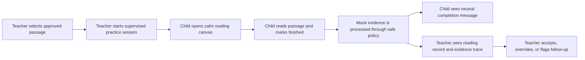

# Reader Leader: Product Realignment and Child Reading Plan

**Status:** Product implementation plan. This document deliberately separates the current hackathon prototype from the functional child-reading MVP it is meant to become.

## 1. The actual idea

Reader Leader is **not** intended to be a teacher dashboard with assorted AI controls. It is a carefully bounded reading-record workflow for a child reading an already approved passage. The child has a calm, simple reading experience; the system listens only with active guardian consent; the system records evidence against the known passage; and an adult retains the authority to interpret and act.

The key promise is not “AI marks reading.” It is: **the system makes the adult’s running record faster to review while preferring uncertainty, silence, and escalation over a false correction.** Regional pronunciation is evidence for interpretation, never an error by default.

| Person | What they need | What they should see |
|---|---|---|
| Child reader | A supportive, low-pressure reading activity | Approved passage, large readable text, a start/finish action, neutral “your reading is being reviewed” status, and approved encouragement only. |
| Guardian | Meaningful control of voice-data use | Plain-language consent, retention/deletion explanation, withdrawal action, and a non-technical confirmation. |
| Teacher/SET | A reliable decision record | Passage assignment, processing status, word-event evidence, audio clip access when authorised, suggested bounded action, and override/review tools. |
| Content steward | Assurance that material is suitable | Draft, rights, safety, audience, region, phonics profile, review history, and approval controls. |
| System | A safe decision boundary | Consent checks, known-text constraint, private storage, analysis pipeline, policy gate, trace, audit, evaluation, retention/deletion lifecycle. |

## 2. Why the current prototype feels incomplete

The current build has substantial **back-office foundations**: tenancy/RLS, consent data, content approval, decision contracts, policy gates, audit trails, evaluation scaffolding, and a synthetic session demonstration. It intentionally does **not** yet contain the experience that makes the product feel like Reader Leader to a judge or a teacher: a child opening a passage, reading it, receiving safe completion feedback, and a teacher seeing the resulting record.

The presentation controls are useful only as a way to demonstrate safety choices. They are not the core product. The next build work should move from **“showing the architecture”** to **“walking through one genuine, safe end-to-end learning journey using synthetic data.”**

## 3. Functional MVP journey

The first useful end-to-end slice should use a fictional learner and an approved synthetic passage. It should not collect voice or claim speech accuracy. Instead, it proves the product experience and safe state transitions.

### 3.1 Child-reading canvas: what to build

The child page should be a **separate route and visual system**, not a compressed teacher dashboard. It must avoid scores, diagnoses, raw confidence percentages, red error markers, progress rankings, and comparative language. It should include:

1. A welcome panel with the passage title and a clearly visible adult-supervised/demo-only badge in hackathon mode.
2. One approved passage rendered in a large, dyslexia-aware, high-contrast reading layout with adjustable text size and line spacing.
3. A simple “Start reading” state that moves to “Read at your own pace.” No countdown, no correction prompts, and no simulated microphone claim unless real capture has been added.
4. A “I am finished” action and an optional child-safe “I want help” action.
5. A neutral, template-driven completion state: “Thank you for reading. Your teacher will look at the next step with you.”
6. No learner identity, session identifiers, audio file data, decision trace, policy decision, or analytics in the page URL or visible interface.

For the hackathon, the child can complete a **synthetic reading interaction** such as highlighting the current sentence or progressing through lines. This must be explicitly labelled as a demonstration and must not pretend to analyse voice.

### 3.2 Teacher flow: what makes it functional

The existing teacher areas should be connected through an obvious workflow:

1. In **Content workflow**, create/approve a passage.
2. In a new **Teacher session setup** view, select a fictional learner and an approved passage, confirm the active synthetic/guardian consent state, and generate a child-session link or launch button.
3. The teacher opens the child reader in a controlled demo session.
4. When the child finishes, the teacher is returned to a **session review** page. In hackathon mode this page shows deterministic synthetic word events and a clearly labelled mock analysis trace.
5. The teacher can choose “Keep as is,” “Add a gentle prompt next time,” “Model the word,” or “Needs human listening,” with a required reason where an override changes the suggested action.

This creates a coherent demonstration: **approved content → consent gate → child reading → safe completion → adult review → auditable next step**.

## 4. Delivery sequence

| Slice | Scope | Definition of done | Explicitly excluded |
|---|---|---|---|
| **A. Child reading canvas** | Separate child-safe route, approved-passage rendering, reading settings, help/finish controls, neutral completion state. | A fictional child can complete a passage in a keyboard-accessible, mobile-friendly flow; no teacher-only content is visible. | Audio capture, scoring, raw confidence, diagnosis. |
| **B. Teacher launch and return** | Teacher setup route, child-session launch, session completion state, teacher session-review entry point. | A teacher can launch a synthetic session and see it enter `CREATED → COMPLETE → READY_FOR_REVIEW`. | Real provider calls and background workers. |
| **C. Deterministic demo record** | Seeded mock word events, safe decision suggestions, teacher review/override, audit linkage. | Every displayed event links to a synthetic trace and a policy-safe action; override remains append-only. | Any claim that the child’s speech was assessed. |
| **D. Guardian visibility** | Adult guardian consent-status/withdrawal view. | Guardian role can read their consent, withdraw it, and see the processing block take effect. | Real identity verification and email delivery until infrastructure is selected. |
| **E. Production speech path** | Private binary upload, signed URLs, physical deletion, speech-provider adapter, alignment, durable worker. | Synthetic/staging session completes through private storage and a provider with deletion/retry tests. | Real child-data pilot until DPIA, agreements, and operational controls are accepted. |

## 5. Functional acceptance criteria for the next slice

The next development task should be **Slice A + the smallest part of Slice B**, not additional dashboard controls. It is complete only when the following are demonstrated.

| Area | Acceptance criterion |
|---|---|
| Child safety | The child route never fetches adult timeline, audit, content-review, raw policy, or confidence data. |
| Content safety | The child can open only an organisation-scoped `APPROVED` passage. A draft or retired passage is denied server-side and client-side. |
| Consent safety | A session cannot launch without active consent. In the hackathon route, this is synthetic consent; it is labelled as such. |
| Interaction | A reader can change text size, navigate the passage by keyboard, request help, and finish without requiring a mouse. |
| Feedback | Completion feedback uses a fixed approved template and includes no score, diagnosis, correction, or promise that speech has been analysed. |
| Teacher continuity | A teacher can launch a session, see its completion, and open its adult review card. |
| Testing | Playwright covers child access, draft denial, expired-consent block, completion, teacher hand-off, and non-exposure of adult-only copy. |

## 6. Non-negotiable implementation boundary

> **Until private binary storage, physical deletion, provider contracts, and safeguarding review are complete, the child route must use synthetic/demo interactions only and must not activate a microphone, upload real recordings, or imply that voice was assessed.**

This boundary is what makes it possible to build a compelling hackathon MVP now without confusing a prototype with a deployable child-data product.

## 7. Recommended immediate build task

Build a **“Reading journey” vertical slice**:

1. A teacher selects one approved synthetic passage and launches a demo session.
2. A child-safe reading canvas displays that passage with simple reading controls.
3. A learner completes the passage and receives neutral encouragement.
4. The teacher sees a deterministic mock reading record and a next-step suggestion.
5. The teacher can append an override/reason and view the safe trace.

That will make the core idea understandable in under two minutes, while the existing consent, audit, content, policy, and trace work remains meaningful infrastructure rather than disconnected screens.
