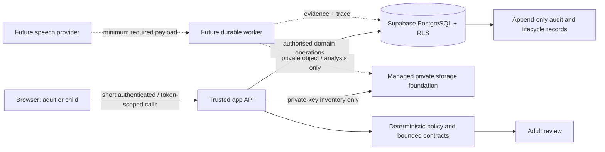

# Reader Leader: Comprehensive Build Guide

**Document status:** Current implementation and delivery guide  
**Project status:** Verified **synthetic-data hackathon MVP** with a production-shaped safety, governance, and audit foundation  
**Last verified baseline:** TypeScript checking; **81 Vitest tests**; **11 Playwright tests**  
**Audience:** Project owner, hackathon judges, implementation team, school/literacy stakeholders, and future pilot partners

---

## 1. Executive summary

Reader Leader is an **adult-governed, accent-aware reading-record workflow**. Its purpose is to support teachers and literacy specialists as they review a child reading an approved passage. The system is deliberately not an autonomous marker, an AI avatar, or a diagnosis tool. It is designed around one safety principle:

> **The system may organise evidence and propose a bounded next action; an adult remains responsible for interpretation, intervention, and the educational decision.**

The current application is a fully demonstrable **synthetic-data journey**. A teacher can select an approved synthetic passage, verify launch readiness, create a consent-gated synthetic session, launch a child-safe reading canvas, complete a mock reading interaction, and return to an adult review containing deterministic mock word events. The project also includes adult content approval, consent/withdrawal/deletion foundations, audit trails, role-based data access, safe presentation controls, and evaluation scaffolding.

It is **not yet a live child-audio or production assessment platform**. It does not activate a microphone, upload or transcribe audio, call a speech provider, calculate a child’s reading score, make a diagnosis, or process real child data. These exclusions are intentional and are central to the project’s safety boundary.[1]

| Current capability | Current state | Meaning |
|---|---|---|
| Adult evidence and policy prototype | Implemented | Demonstrates bounded evidence, safe decision actions, teacher briefing, and evaluation gates. |
| Organisation, membership, and tenant protections | Implemented | Supabase Row Level Security (RLS), membership checks, actor linking, and live multi-organisation tests protect school boundaries. |
| Content approval workflow | Implemented | Adult governance roles can draft, clear rights/safety, approve, retire, and audit passages; teachers receive approved passages only. |
| Synthetic reading journey | Implemented | Teacher launch → child canvas → completion → deterministic adult review, with no audio collection. |
| Consent and deletion lifecycle foundation | Implemented | Versioned consent, withdrawal, retention eligibility, deletion requests, inventory, receipts, and audit are modelled and verified using synthetic records. |
| Production speech assessment | Deferred | Requires private binary storage, physical deletion, provider agreements, durable processing, testing, and safeguarding approval. |

---

## 2. Product purpose and user promise

### 2.1 What Reader Leader is intended to do

Reader Leader supports a short, known-passage reading activity. A child should see a calm reading surface. A teacher should receive a structured reading record that makes evidence, uncertainty, and the basis for a suggested next action visible. The system knows the passage in advance, so any eventual speech analysis is constrained against a reference text rather than treated as open-ended dictation.[2]

The system is optimised for **safe intervention**. A mistaken correction can be more harmful than a missed intervention, particularly where regional pronunciation, self-correction, hesitation, or noisy input is involved. Therefore, abstention and escalation are meaningful outputs—not failures.

The target teacher decision options are bounded: **prompt**, **model**, **stay silent**, or **escalate**. No model can add an unrecognised action, change a learner’s reading level, or issue a clinical or diagnostic conclusion.[2]

### 2.2 What Reader Leader is not

Reader Leader must not be presented as the following:

| It is not | Why this matters |
|---|---|
| A replacement for teacher judgement | The teacher/SET remains the final decision-maker and can append an override with a reason. |
| A dyslexia or learning-needs diagnostic tool | The current and planned system cannot make clinical or diagnostic claims. |
| An automated pass/fail reading scorer | Safety policy favours uncertainty, silence, and escalation when evidence is incomplete. |
| A child analytics dashboard | Child-facing screens deliberately omit scores, rankings, raw confidence, adult notes, and decision traces. |
| A live voice-recording product today | The current application is mock-only and accepts no audio bytes. |
| An open content publishing tool | A passage is learner-visible only after adult rights, safety, and approval gates pass. |

---

## 3. Current application architecture

### 3.1 Implemented stack

The current project runs as a TypeScript full-stack web application using **React 19**, **Vite**, **Express**, **tRPC**, **Zod**, **Tailwind**, and Supabase PostgreSQL. Manus authentication supplies the application user session; an actor-link bridge connects that user to a Supabase Auth identity for domain-data access. The current application architecture is implementation-ready for the hackathon, while the long-term delivery plan recommends a Next.js/serverless deployment surface for production.[2]

| Layer | Current implementation | Responsibility |
|---|---|---|
| Browser application | React, Tailwind, shadcn/ui primitives, tRPC client | Adult workspaces, child reading canvas, safe presentation state, responsive UX. |
| Application API | Express + tRPC + TypeScript | Validates inputs, resolves application user, authorises actions, and exposes small task-based procedures. |
| Validation | Shared Zod contracts | Gives the browser and server the same strict type/format expectations. |
| Relational domain data | Supabase PostgreSQL | Organisations, memberships, learners, passages, sessions, consent, reviews, traces, and audit data. |
| Access policy | Supabase RLS + server-side membership checks | Enforces tenant and role boundaries even for direct database access. |
| Static/managed storage foundation | Managed private storage adapter and protected inventory | Uses pseudonymous keys and hash-only inventory; no live child audio is accepted. |
| Deterministic safety layer | Contracts, policy gate, gold-pack evaluation | Constrains proposed actions and provides regression evidence. |
| Presentation utilities | Browser-local JSON/PDF export, print styles, Demo Mode | Enables a safe judge demo without exporting identifiers or voice data. |

### 3.2 Current and future trust boundaries

The browser is an untrusted environment. It never receives a Supabase service-role key, storage key, raw audit record, or live provider credential. The public child route uses a short-lived opaque token that the database stores only as a hash. The child API response is deliberately smaller than the adult response.[3]

---

## 4. Roles, user types, and access model

Reader Leader has two distinct identity layers. The first is an **application-level account** used to sign into the dashboard. The second is a **Supabase organisation membership**, which controls which school data the person can access. The domain role is the important security boundary for Reader Leader data.

### 4.1 User types

| User type | Main responsibility | Current access and experience | Must not be able to do |
|---|---|---|---|
| **Unauthenticated visitor** | None | Can reach public shell routes but is redirected to sign in before adult workspace access. | Read school, learner, consent, content, trace, or review records. |
| **School administrator** (`school_admin`) | Organisation oversight and controlled demonstration setup | Can use adult workspaces, content governance, teacher session setup, synthetic reset, and appropriate organisation records. | Access a different organisation’s data; receive child token history; bypass consent/passage gates. |
| **Literacy lead** (`literacy_lead`) | Literacy programme quality, review, and approved content governance | Can manage content approval and review synthetic sessions. | Grant themselves guardian authority; see data outside the organisation. |
| **Teacher / SET** (`teacher_set`) | Launch approved reading sessions and review the reading record | Can use Session demo, see safe session history, complete teacher review, acknowledge their own completed-session alert, and use learner safety controls allowed by role. | Create guardian consent on behalf of an unlinked guardian; inspect unapproved passage drafts; see another teacher’s acknowledgement state as their own. |
| **Content steward** (`content_steward`) | Rights, safeguarding, region, and passage approval | Can create/review drafts and set content gates. | Publish content without both rights and safety approval; expose drafts to teachers/children prematurely. |
| **Guardian** (`guardian`) | Consent and data-lifecycle control for linked learners | Current protected API foundation supports recorded consent, withdrawal, deletion request, retention eligibility, and deletion receipt status for linked learners. | Access unrelated learners or write internal lifecycle audit events. A guardian self-service UI remains future work. |
| **Learner / child reader** (`learner`) | Read an approved passage in a supportive session | In the current demo, uses a short-lived public child link rather than a persistent child account. Sees approved text, reading settings, help, finish, local progress, and local bookmark controls. | See names, score, audio controls, decision traces, word events, teacher notes, raw confidence, diagnostics, or adult navigation. |
| **Judge / presenter** | Observe the hackathon journey | Uses adult Demo Mode and the guided tour. This is not a persistent data role. | Treat synthetic records as real learner assessment evidence. |
| **Trusted server / future worker** | Execute privileged, auditable operations | Executes authorised database/server operations and future deletion/analysis work. | Be exposed to the browser; bypass the policy/audit model without records. |

### 4.2 Authorisation principles

1. **Organisation first:** Data belongs to an organisation. Membership and RLS are checked before a record is read or changed.
2. **Least privilege:** Teachers receive only the aggregate consent readiness state required to launch a session. Guardian consent-management routes remain guardian-only.
3. **Adult/child separation:** The child route has a separate data contract and never receives adult review information.
4. **Append rather than overwrite:** Overrides, withdrawals, acknowledgements, content review events, lifecycle events, and deletion receipts preserve historical evidence.
5. **Synthetic scope control:** Hackathon child links require a session tagged as `demo_mode`; the public child route fails closed if the token, consent, scope, or approval gate is invalid.

---

## 5. Domain model and database schema

The data model is event-oriented around a reading session. Raw inputs and prior decisions are preserved; subsequent human corrections and lifecycle actions are appended as separate records. The shared Zod contracts and typed Supabase `Database` definitions make a mismatch between snake_case database columns and camelCase application contracts visible during development.[1]

### 5.1 Core organisation and reading entities

| Entity/table | Role in the system | Important fields and relationships |
|---|---|---|
| `organisations` | Tenant root | Name, region, policy context. |
| `memberships` | Organisation role assignment | Supabase user ID, organisation ID, domain role. |
| `reader_leader_actor_links` | Application-to-Supabase identity bridge | Manus open ID to Supabase user ID. |
| `learners` | Learner record | Organisation ID, display name, safe label, phonics/pronunciation context. Safe label is used in adult minimal displays. |
| `passages` | Versioned reading content | Title, text, region tags, phonics profile, rights/safety/approval status. |
| `content_review_events` | Content governance history | Append-only rights, safety, approval, and retirement actions. |
| `reading_sessions` | Main workflow record | Learner, passage, organisation, lifecycle status, idempotency key, synthetic-demo marker, start/completion times. |
| `child_session_tokens` | Child launch boundary | SHA-256 token hash, expiry, start/help/completion timestamps, issuing adult. |
| `mock_session_uploads` | Hackathon-only metadata record | Synthetic filename/media type/size, not audio bytes. |
| `mock_analysis_jobs` | Persisted mock job state | Queued/running/ready/failed/retrying state, attempt count, trace ID. |
| `mock_analysis_trace_events` | Safe mock workflow trace | Immutable safe stage and bounded safe summary. |
| `mock_word_events` | Adult-only demo reading record | Deterministic word index, reference word, event type, suggested action, and teacher note. |

### 5.2 Consent, retention, and deletion entities

| Entity/table | Purpose | Key safeguards |
|---|---|---|
| `guardian_learner_links` | Proves guardian relationship for a learner | Guardian-scoped RLS and composite relationship key. |
| `consents` | Versioned purpose-specific consent | Training opt-in is constrained to `false`; retention end and status are required. |
| `consent_withdrawals` | Immutable withdrawal evidence | One withdrawal per consent; database trigger changes linked status to `WITHDRAWN`. |
| `data_deletion_requests` | Guardian request to remove audio/derived data | Requires withdrawn state; changes consent to `PENDING_DELETION`. |
| `audio_assets` | Future private audio inventory | Hashes, pseudonymous/private key state, retention/deletion fields; no audio bytes. |
| `derived_data_assets` | Future derived-data inventory | Tracks alignment/provider/decision derivative objects separately. |
| `data_deletion_receipts` | Evidence of a deletion verifier result | Hash-only reference and `DELETED`, `NOT_FOUND`, or `BLOCKED` outcome. |
| `data_lifecycle_audit_events` | Minimal immutable lifecycle history | Server-only write path; no free-text voice content or object keys. |
| `teacher_session_alert_acknowledgements` | Teacher-specific review-alert dismissal | Unique teacher/session record; acknowledgement never removes session completion/history. |

### 5.3 Decision, safety, evaluation, and audit entities

| Entity/table | Purpose |
|---|---|
| `evidence_bundles` | Stores structured evidence inputs and confidence values for an event. |
| `agent_decisions` | Stores bounded action, reason, evidence references, policy version, and trace ID. |
| `human_reviews` | Append-only adult overrides; never overwrites original decision. |
| `learner_safety_decisions` / `learner_safety_events` | Persisted safety timeline and override/reversal history. |
| `audit_events` | General immutable audit evidence for high-value actions. |
| Gold-pack fixtures and evaluation reports | Deterministic replay and regression gates for policy/evidence changes. |

---

## 6. Current routes and screens

| Route | Audience | Purpose | Important boundary |
|---|---|---|---|
| `/` | Authenticated adult | **Evidence desk**: fixture-backed evidence, safe teacher briefing, child-safe projection, and evaluation health. | It is an adult-facing evidence prototype, not the child reader. |
| `/learner-safety` | Authorised adult | Learner selector, timeline, audit history, append-only override/reversal controls, and safe child projection. | Role-derived content; timeline integrity errors become a safe actionable state. |
| `/content-workflow` | Teacher/content governance roles | Draft passage, rights/safety gates, approval state, review queue/filter, and approved teacher selection. | Drafts are unavailable to ordinary teachers/children until approval. |
| `/session-demo` | Authorised adult | Main synthetic demonstration: consent readiness, launch checklist, session setup, child launch, mock upload metadata, mock job trace, history, alerts, reset, judge tour. | Explicit Demo Mode; no audio is captured or transmitted. |
| `/read/:token` | Child with valid synthetic launch link | Separate child reading canvas. | Opaque short-lived token; only approved passage/safe state; no adult data. |
| `/session-review/:sessionId` | Authorised adult | Deterministic mock word events and adult review hand-off. | Printable/PDF exports minimise identifiers and exclude audio/storage data. |

---

## 7. How to use the current application

### 7.1 Recommended judge or hackathon demonstration

The fastest way to explain Reader Leader is to show one complete synthetic journey. The current demo workspace begins in clearly labelled **Demo Mode** and is backed by a fictional organisation, learner, active synthetic consent, and approved passage.

| Step | Action | What the viewer should understand |
|---|---|---|
| 1 | Sign in and open **Content workflow**. | Passage use is controlled by adult rights, safety, and approval gates. |
| 2 | Open **Session demo**. | The launch checklist verifies learner choice, approved content, consent readiness, and synthetic/no-audio mode. |
| 3 | Create a consent-gated mock session. | The system does not allow a session to start merely because a passage was selected. |
| 4 | Select **Launch child reading canvas**. | The child session is reached only through a short-lived teacher-issued link and is not a normal adult dashboard menu item. |
| 5 | In the child canvas, select **Start reading**, optionally **Ask for help**, move through passage parts, use reading preferences, and choose **I am finished**. | The learner experience is calm and supportive; no score, microphone, confidence, or diagnosis appears. |
| 6 | Return to the adult tab and select **Review completed mock record**. | The adult sees deterministic mock events and retains final judgement. |
| 7 | Use the **Review ready** filter, acknowledge the alert, print/download the safe summary, or review the trace. | Completion tracking and export are adult-only, role-protected, and identifier-minimised. |

### 7.2 Content approval workflow

1. An authorised content steward, literacy lead, or school administrator opens **Content workflow**.
2. They create or inspect a draft passage.
3. Rights and safety are reviewed independently. The approval action is unavailable until both gates are complete.
4. Approval creates an append-only review event. The approved passage then appears in teacher selection; the draft queue remains governance-only.
5. Teachers select only approved passages when creating a synthetic reading session.

### 7.3 Teacher session workflow

1. Open **Session demo** and select an organisation.
2. In Demo Mode, the app preselects synthetic learner/passage fixtures. In manual mode, select values explicitly.
3. The pre-launch checklist reads an aggregate staff-authorised launch-readiness result. It does **not** call guardian-only consent-management APIs.
4. Create the session. The session history will show an unambiguous state such as **ready to start**, **reading**, **completed**, or **review ready**.
5. Launch the child reader. The history never stores/shows child launch URLs.
6. When completed, open adult review, then acknowledge the teacher alert if it has been reviewed. Acknowledgement removes the item only from the current teacher’s notification count; it does not change the child session or erase evidence.

### 7.4 Child reading workflow

1. The child opens the time-limited synthetic link supplied by a supervising adult.
2. The server rechecks the token, expiry, synthetic-session tag, approved passage, and active consent state.
3. The child sees only the approved text and safe controls: text size, line spacing, Focus mode, local passage-part navigation/progress, Save my place, Return to saved part, Clear saved place, Ask for help, and finish.
4. A bookmark is stored only in the local browser for that synthetic session. It is not sent to the server and is not treated as an educational metric.
5. Selecting finish records synthetic completion and deterministic mock events. The child receives a fixed neutral message: the teacher will consider the next step.

### 7.5 Guardian consent, withdrawal, and deletion flow

The database/API foundation is implemented; a guardian self-service screen is not yet built.

1. A linked guardian records purpose-specific consent for `READING_ASSESSMENT`, a consent-copy version, policy version, future retention date, and an idempotency key. Training remains opt-out by design.
2. Withdrawal appends a record rather than editing history. A database trigger sets consent to `WITHDRAWN` immediately.
3. A deletion request becomes available after withdrawal and moves consent to `PENDING_DELETION`.
4. The privileged server-side verifier processes inventory items and writes hash-only deletion receipts. In the current managed-storage setup, access keys are revoked and inventory state is closed; provider-level physical deletion remains a required future capability.[4]

---

## 8. Safety, privacy, and safeguarding controls

### 8.1 Controls already implemented

| Safety concern | Current control |
|---|---|
| Cross-school data access | Organisation membership checks plus Supabase RLS; live two-organisation tests. |
| Wrong role viewing consent state | Guardian management remains guardian-only; teacher launch readiness returns only a minimal aggregate result. |
| Unapproved content reaching a child | Teacher and child access are limited to `APPROVED` passages; content governance controls draft access. |
| Child access to adult evidence | Separate child contract and route; browser tests confirm adult-only copy/data does not appear. |
| Unsafe or overconfident AI behaviour | Strict action enums, Zod contracts, policy gate, regional-variant handling, confidence/patience rules, and adult override. |
| Data-contract regressions | Typed Supabase database surface, explicit snake_case normalisers, strict timestamp validation, and privacy-safe contract-boundary logging. |
| Unreviewable system decisions | Trace IDs, deterministic mock traces, evidence references, append-only decision and override records. |
| Unclear synthetic status | Demo Mode labels, synthetic-only scope checks, mock-only export labels, and no-audio messaging. |
| Excessive data in presentation export | JSON/PDF/print paths exclude learner labels, session IDs, child links, audio data, transcript, storage metadata, and raw confidence. |

### 8.2 Non-negotiable current boundary

> **The application must continue to use synthetic/demo interactions only. It must not activate a microphone, accept real recordings, store audio bytes, perform transcription, assess live speech, or imply that a child’s spoken reading has been analysed.**

Before real child voice data is considered, the project needs a formal privacy/safeguarding review, a documented data-flow map, provider agreement review, physical storage deletion capability, a tested backup/deletion process, secure upload and worker implementation, and supervised user testing. This is an engineering and governance prerequisite, not a cosmetic improvement.[2]

---

## 9. Verification and quality evidence

The current automated baseline contains **81 Vitest tests across 23 files** and **11 Playwright browser tests**. This is not proof of production readiness, but it does demonstrate that key contracts, tenant boundaries, workflow gates, and interface behaviours have regression coverage.

| Test layer | Current coverage |
|---|---|
| TypeScript | `pnpm check` validates shared contracts, tRPC inputs/outputs, typed Supabase client use, and UI integrations. |
| Unit and contract tests | Policy thresholds, bounded action values, row mapping, timestamp normalisation, consent eligibility, child progress, child token boundary, session history safety, PDF structure, and role readiness logic. |
| Live Supabase integration | Two-organisation RLS isolation, membership roles, guardian lifecycle access, deletion triggers/receipts, server-only audit writes, and content draft/approval RLS boundaries. |
| tRPC tests | Malformed input rejection before persistence and protected procedure contracts. |
| Browser tests | Authenticated adult navigation, content approval separation, session creation/trace demo, child help/finish flow, adult hand-off, child/adult data separation, Demo Mode, filtering, bookmarking, acknowledgement, print control, and PDF download. |
| Visual review | Desktop and mobile screenshots for the teacher session workspace and core presentation controls. |

### 9.1 Core project commands

| Command | Purpose |
|---|---|
| `pnpm check` | Run TypeScript compilation without emitting files. |
| `pnpm test` | Run the full Vitest suite, including configured live Supabase RLS tests. |
| `pnpm e2e` | Run Playwright browser scenarios. |
| `node scripts/apply-supabase-migration.mjs <migration-file>` | Apply an allowlisted Reader Leader PostgreSQL migration to the linked Supabase project. |
| `node scripts/seed-hackathon-demo.mjs` | Idempotently seed only the fictional synthetic demo fixture. |

Database migrations are ordered under `supabase/migrations/` and mirror the typed Supabase declarations in `server/reader-leader/supabase.generated.ts`. Keep both updated whenever a table or column used by the application changes.

---

## 10. Operations and incident model

The current operational model is intentionally modest because analysis jobs are mocked. A synthetic session persists durable **demo state** so the teacher can show a replayable path, but no autonomous background worker is running in the deployed web application.

| Mock state | Current meaning | Teacher/presenter action |
|---|---|---|
| `CREATED` | Consent-gated synthetic session exists. | Launch the child canvas. |
| `CHILD_READING` | Child has started the synthetic interaction. | Wait for safe finish state. |
| `COMPLETED` | Child has selected finish. | Open adult review. |
| `ANALYSING` | Mock upload metadata/job record exists. | Use deterministic mock trace controls if demonstrating analysis state. |
| `READY` | Deterministic adult review is available. | Review, optionally acknowledge, print, or export safe PDF. |
| `BLOCKED` / `FAILED` / `RETRYING` | Safe mock lifecycle state. | Present the safe state; do not circumvent a consent/policy block. |

The runbook in `OPERATIONS_RUNBOOK.md` documents mock trace correlation, safe manual retry demonstration, replay, and the boundary between hackathon operations and a real incident process. Production operations require durable workers, monitoring, alert delivery, access reviews, incident response, and replay evidence.[5]

---

## 11. What still needs to be built

### 11.1 Remaining work for a fully functioning production MVP

The project is currently a strong **synthetic vertical slice**, not a production pilot. The following work is needed in sequence.

| Priority | Workstream | Required implementation | Definition of done |
|---|---|---|---|
| 1 | Production storage and data lifecycle | Private binary upload, short-lived signed URLs, server-side physical deletion API or lifecycle policy, version-aware deletion, storage backup/deletion verification. | A synthetic/staging recording can be uploaded, authorisation is enforced, every derived copy is found, physical deletion is verified, and receipts are recorded. |
| 2 | Real session orchestration | Replace mock upload metadata and manual mock jobs with idempotent session completion and durable background tasks. | A session moves safely from upload to analysis without long-running browser/API requests. |
| 3 | Speech provider adapter and alignment | Implement `SpeechProvider`, reference-text alignment, input/output hashing, provider versioning, and outage handling. | Held-out synthetic/adult-performer cases run repeatably; uncertain evidence remains visible and cannot bypass policy. |
| 4 | Bounded judgement runtime | Connect structured model/provider evidence to the existing deterministic policy engine, tracing, and replay gate. | Invalid/low-confidence/unreferenced output is rejected or safely escalated; gold-pack regression gate passes. |
| 5 | Guardian experience | Create a guardian-facing consent status, consent, withdrawal, and deletion status interface with clear plain-language copy. | A linked guardian can complete lifecycle actions without accessing teacher/content data. |
| 6 | Teacher review maturity | Add actual running record visualisation, signed relevant audio clips, review workflow status, safe follow-up notes, and pagination at realistic volumes. | Teachers can complete a supervised review efficiently without hidden automation. |
| 7 | Production identity and environments | Separate dev/staging/production projects, invitations, school SSO/OIDC/SAML as needed, secrets rotation, branch protection, CI migration discipline. | Environments are isolated and access is reviewed. |
| 8 | Pilot governance and operations | DPIA, data-processing agreements, vendor review, data residency/backup policy, retention schedule, audit-access policy, incident response, training, and supervised usability testing. | Governance approval and a limited supervised pilot plan exist before real child voice collection. |

### 11.2 Low-cost hackathon improvements that can still be useful

If the immediate goal is a stronger hackathon presentation without real voice processing, the following additions are safe and valuable:

1. A compact teacher session timeline showing the most recent synthetic launch, child completion, review-ready state, and acknowledgement.
2. A guided two-minute demo script with clear “what the system does not do” messaging.
3. Additional deterministic cases demonstrating a valid regional pronunciation, a self-correction, and an uncertain/noisy case where the system stays silent or escalates.
4. A guardian consent-status mock screen that is visibly synthetic and does not accept real personal data.
5. A one-page architecture/safeguarding explainer based on the existing trace, RLS, consent, and content-approval model.

### 11.3 Recommended child-centred build path

The recommended next product investment is a **teacher-assigned child reading shelf with adult-approved vocabulary cards**, not more generic gamification or an early live-audio feature. It gives children aged 8–10 a clearer reason to return to the product while retaining Reader Leader’s defining adult evidence workflow. The child journey should reward participation, completing a reading path, exploring a word, and asking for help; it must not score speech, rank children, reward perceived accuracy, or present a reading level as a judgement.

The detailed implementation specification—including child screens, vocabulary-card model, non-competitive motivation rules, adult controls, additive database model, Zod/tRPC contracts, implementation tools, live-audio prerequisites, acceptance tests, and staged roadmap—is in [Child-Centred Implementation and Technology Plan](CHILD_CENTRED_IMPLEMENTATION_AND_TECHNOLOGY_PLAN.md).[7]

---

## 12. Suggested delivery roadmap

### Phase A — Consolidate the hackathon MVP

Demonstrate the complete synthetic reading journey reliably using the current demo fixture. Ensure the presentation describes it as **synthetic**, **adult-governed**, and **no audio collected**. Keep all current safety tests green.

### Phase B — Prepare a safe staging data path

Select a delete-capable private storage provider, confirm available credits/funding and region, then implement private upload and physical deletion with synthetic or adult-performer recordings only. Do not connect a live child microphone at this stage.

### Phase C — Add durable speech/evidence processing

Introduce a provider adapter, known-text alignment, idempotent durable jobs, correlation IDs, trace storage, redacted alerts, and a gold-pack replay pipeline. Every provider/model/policy change must be evaluated against the same held-out test set.

### Phase D — Pilot readiness

Build guardian self-service, content-management maturity, school onboarding, operational support tooling, safe audio playback, backup/deletion verification, and a formal safeguarding/data-protection review. Proceed only with a small supervised pilot that measures adult review usefulness and false-correction safety rather than claiming autonomous accuracy.

---

## 13. Repository guide

| Path | What it contains |
|---|---|
| `client/src/pages/` | Adult Evidence desk, Learner safety, Content workflow, Session demo, Child reader, and Session review screens. |
| `client/src/components/DashboardLayout.tsx` | Authenticated navigation, teacher review-ready badge, responsive dashboard layout. |
| `server/routers.ts` | tRPC public/protected procedure map. |
| `server/reader-leader/` | Domain services: consent lifecycle, content workflow, session demo, child journey, private storage lifecycle, policy/evaluation helpers. |
| `shared/` | Shared Zod contracts and deterministic helpers used by browser and server. |
| `supabase/migrations/` | Ordered PostgreSQL/RLS schema changes. |
| `server/reader-leader/supabase.generated.ts` | Migration-derived typed Supabase table declarations. |
| `server/*.test.ts` and `client/**/*.test.ts` | Vitest contract, integration, and regression coverage. |
| `e2e/learner-safety.spec.ts` | Playwright application journeys, including adult/child boundary checks. |
| `SYNTHETIC_READING_JOURNEY.md` | Current child/teacher synthetic journey and demonstration details. |
| `PRIORITY_1_IMPLEMENTATION.md` | Consent, withdrawal, retention, deletion, and audit foundation. |
| `PRIVATE_STORAGE_AND_CONTENT_WORKFLOW.md` | Private-key lifecycle and content governance detail. |
| `OPERATIONS_RUNBOOK.md` | Hackathon mock-operation/replay guidance. |
| `BUILD_STATUS.md` | Concise current-status and priority reference. |
| `todo.md` | Full historical delivery tracker; viewer truncation does not mean the file is incomplete. |

---

## 14. Final implementation position

Reader Leader now has a coherent, working **synthetic product story** rather than a set of disconnected screens. The child-side experience exists but is deliberately launched by a teacher and intentionally constrained: it is a safe reading canvas, not a live listening tool. The adult-side application shows why consent, approved content, tenant boundaries, policy limits, traceability, and human judgement matter before any speech technology is introduced.

The highest-value next decision is not another dashboard feature. It is whether and how to fund a private, delete-capable storage and durable-worker staging path. Until then, the correct use of the current application is as an audited, synthetic demonstration of the Reader Leader workflow.

---

## References

[1]: [Current Reader Leader build status](BUILD_STATUS.md)  
[2]: [Reader Leader development plan](specification/Development_Plan.md)  
[3]: [Synthetic reading journey implementation guide](SYNTHETIC_READING_JOURNEY.md)  
[4]: [Consent, withdrawal, retention, and deletion implementation](PRIORITY_1_IMPLEMENTATION.md)  
[5]: [Private storage and content workflow guide](PRIVATE_STORAGE_AND_CONTENT_WORKFLOW.md)  
[6]: [Hackathon operations runbook](OPERATIONS_RUNBOOK.md)  
[7]: [Child-Centred Implementation and Technology Plan](CHILD_CENTRED_IMPLEMENTATION_AND_TECHNOLOGY_PLAN.md)  
